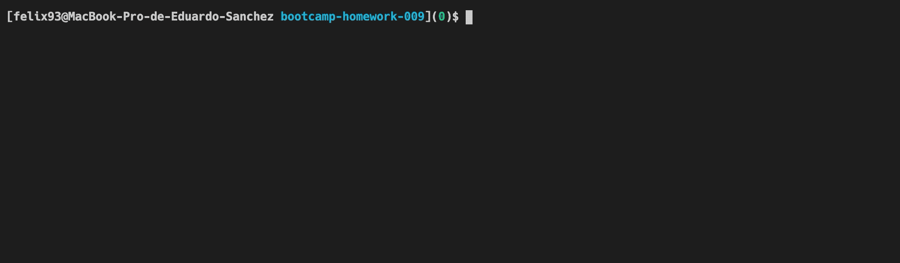
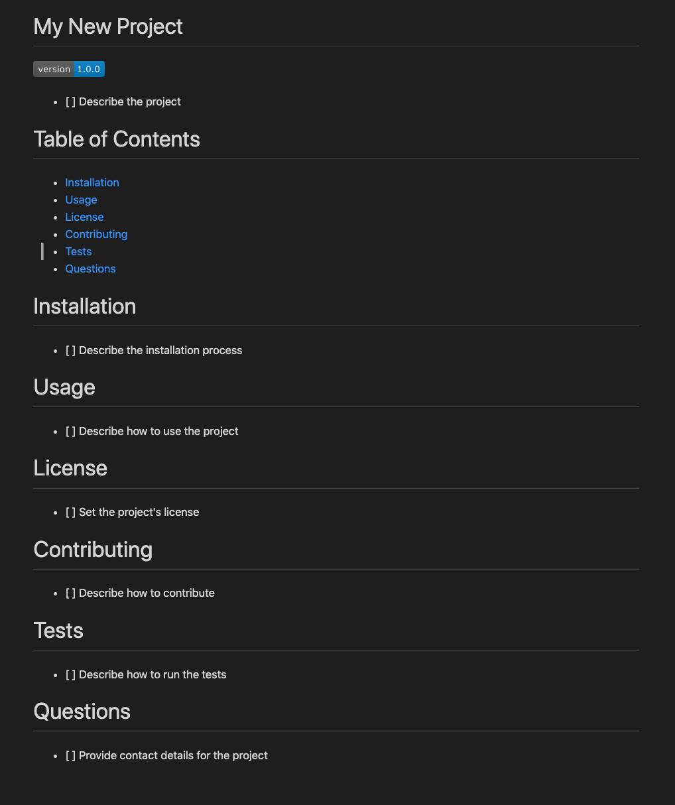
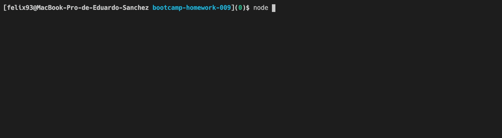
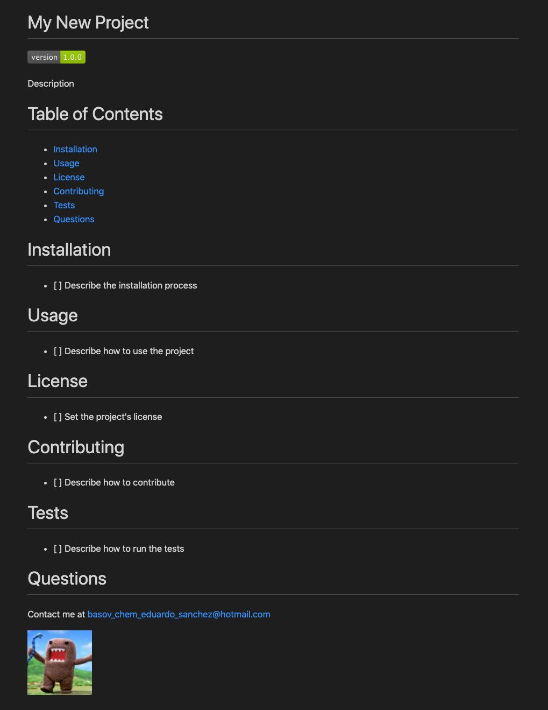

# README Generator

This application generates a README.md file from an inquiry. This file was actually generated by this application.

## Default Flow Demo

Result

## Test Flow Demo

Demo Video

Result

# Table of Contents

- [Installation](#installation)
- [Usage](#usage)
- [License](#license)
- [Contributing](#contributing)
- [Tests](#tests)
- [Questions](#questions)

# Installation

To install, download or clone the repository, then navigate to the repository folder in your terminal and execute `npm install`

# Usage

To generate a README file, install the project and then execute `node index.js`, optionally, you can provide the file name as an option as in `node index.js '<FILE_NAME>'`

# License

This project is licensed under the MIT License

# Contributing

Create a pull request, I'll review, make some comments if needed and approve ;)

# Tests

This project contains no tests

# Questions

Contact me at [basov_chem_eduardo_sanchez@hotmail.com](mailto:basov_chem_eduardo_sanchez@hotmail.com)

